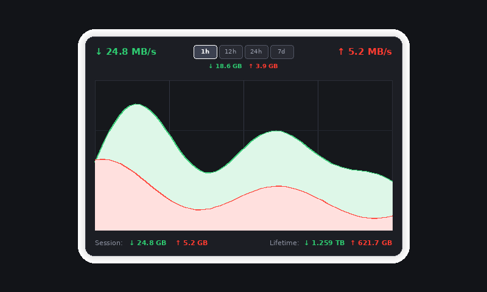

# qBittorrent Speed Monitor Plasmoid (Widget-qBittorrent-nox)

> [!NOTE]
> **Questions, custom configs, or ideas?** Join us on Reddit at <nobr>[**r/PlasmaDrifterProjects**](https://reddit.com/r/PlasmaDrifterProjects)</nobr>!

A lightweight, modern, and highly customizable **KDE Plasma 6** widget for monitoring real-time download/upload network traffic, historical transfer graphs, and lifetime statistics from your **qBittorrent-nox** or desktop qBittorrent WebUI.



---

## Features

- **Low CPU & Low Disk I/O**:
  - Adaptive polling (12-second relaxed background intervals when closed, fast live polling only when the popup is expanded).
  - Batched KConfig disk writes (10-minute intervals and system exit) to prevent constant drive activity.
  - Efficient HTML5 / QtQuick Canvas smooth Bezier spline graph rendering.
- **Multi-Timeframe Transfer History**:
  - View network activity curves across **1 hour**, **12 hours**, **24 hours**, and **7 days**.
  - Displays total data transferred (downloaded & uploaded) specifically for the selected timeframe.
  - Persistent historical data caching across sessions and system reboots.
- **Session & Lifetime Data Accounting**:
  - Live session download and upload counters.
  - Persistent lifetime data tracking with configurable starting totals.
- **Appearance & Customization**:
  - Customizable panel icon (native KDE icon selector or custom image file browser from `/usr/share/icons`).
  - Optional custom icon tinting / colourizing.
  - Configurable background color, opacity, corner rounding radius, text color, and individual download/upload curve colors.
- **Secure Authentication**:
  - Full session cookie (`QBT_SID`) handling with automatic reconnect and re-authentication.

---

## Installation

### Manual Installation

1. Clone or download this repository into your local Plasma plasmoids directory:

```bash
mkdir -p ~/.local/share/plasma/plasmoids/
git clone https://github.com/PlasmaDrifter/Widget-qBittorrent-nox.git ~/.local/share/plasma/plasmoids/local.widget.qbittorrentgraph
```

2. Reload `plasmashell` or log out and log back in:

```bash
plasmashell --replace &
```

3. Right-click on your KDE panel or desktop, choose **Add Widgets...**, and search for **qBittorrent Speed Monitor**.

---

## Configuration

Right-click the widget on your panel or desktop and select **Configure qBittorrent Speed Monitor...**:

- **Connection**:
  - **Web UI URL**: `http://<ip-or-hostname>:<port>` (e.g. `http://localhost:8080` or Tailscale IP).
  - **Username & Password**: Your qBittorrent Web UI credentials.
  - **Update Interval**: Polling frequency (default: 4 seconds).
- **Scaling & Display**:
  - **Download Max Scale (MB/s)** & **Upload Max Scale (KB/s)**: Set your network bandwidth ceiling for proportional graph scaling.
  - **Display Session & Lifetime Data Usage**: Toggle bottom footer visibility.
- **Appearance & Colors**:
  - **Panel icon / file**: Choose system icon or browse for custom `.png` / `.svg` files.
  - **Color Pickers**: Customize icon tint, background color, text color, download graph color, and upload graph color.

---

## Requirements

- **KDE Plasma**: 6.0+
- **Qt Quick**: 6.0+
- **qBittorrent**: v4.1+ (with WebUI enabled in settings)

---

## License

This project is licensed under the [GNU General Public License v3.0](LICENSE).

---

## 💬 Community & Discussions

Got questions, setup ideas, or feedback?

* 🌐 Join our subreddit at [**r/PlasmaDrifterProjects**](https://reddit.com/r/PlasmaDrifterProjects) to discuss updates, get support, and share configurations.
